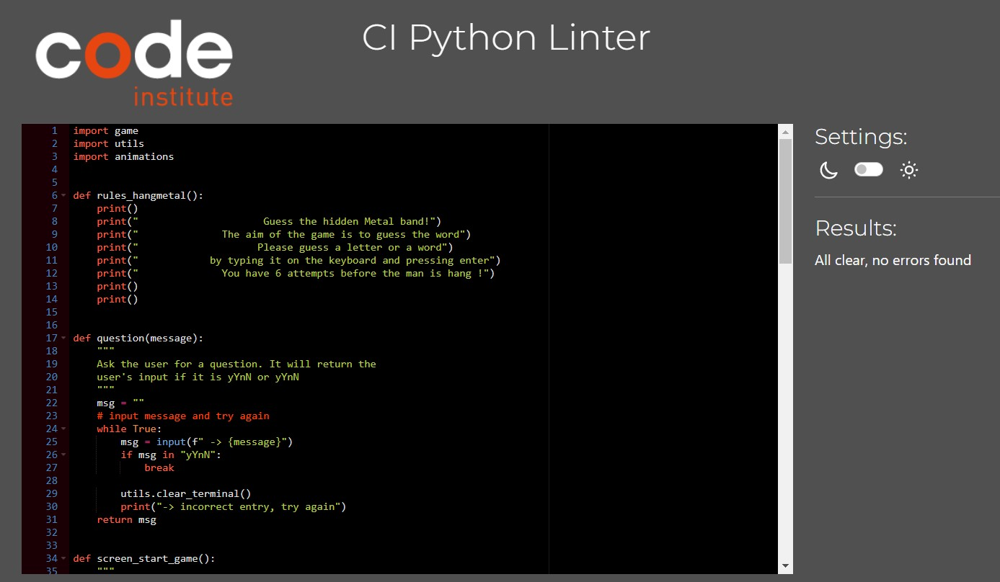

# Hangmetal

Welcome to the captivating world of Hangmetal! Immerse yourself in the realm of thunderous riffs, blazing solos, and intense guttural vocals. Get ready to test your metal knowledge by guessing the names of legendary metal bands, one letter at a time, or if you already know the answer type the word.

With every correct guess, you are close to winning! But be cautious, as each wrong guess brings you nearer to the metalhead's dreaded fate - the hanged man!
Summon your inner metal aficionado, and embark on this journey through Hangmetal. Every attempt can reveal a band that you don't know and increase your knowledge about this beautiful music genre.

The Hangmetal project is live, the links can be found [HERE](https://hangmetal-a0fc16afad72.herokuapp.com/)

## Table of Contents
+ [Features](#features "Features")
  + [Main page](#main-page "Main page")
  + [Game Screen](#game-Screen "Game Screen")
  + [Incorrect Attempt](#incorrect-attempt "Incorrect Attempt")
  + [Type Warning](#type-warning "Type warning")
  + [Correct Attempt](#correct-attempt "Correct Attempt")
  + [Win Screen](#win-screen "Win Screen")
  + [Lose Screen](#lose-screen "Lose Screen")
  + [Exit Game](#exit-game "Exit game")
+ [Testing](#testing "Testing")
  + [Validator Testing](#validator-testing "Validator Testing")
  + [Unfixed Bugs](#unfixed-bugs "Unfixed Bugs")
+ [Technologies Used](#technologies-used "Technologies Used")
  + [Main Languages Used](#main-languages-used "Main Languages Used")
  + [Programs Used](#programs-used "Programs Used")
+ [Deployment](#deployment "Deployment")
+ [Credits](#credits "Credits")
  + [Content](#content "Content")
  + [Media](#media "Media")

## FEATURES

### Main page:
This page showcases the game's title in a distinct font style, while also providing users with the opportunity to review the instructions and make an informed decision on whether they wish to start the game.

### Game Screen: 

Within the game interface, you will find a prominent display of the hangman's progress, accompanied by blank spaces representing the letters of the word to be guessed. Additionally, below this, you will observe the incorrect answers or letters attempted. Furthermore, there is a designated area to input the letters or words.

### Incorrect Attempt:
Here we can see what is occurring if the letter guessed is wrong.

### Type warning:
The system is designed to display an warning message atop the screen whenever the user attempts to input a space, number, or special character, informing them that the input is incorrect. The message prompts the user to re-enter the input accurately.

 - For numbers:

 - Space

### Correct Attempt:
Here we can see what is occurring if the letter guessed is write.

### Win Screen:
If the user correctly guesses the answers before using up all their attempts, a "Win" display will appear, along with relevant visuals. They can then choose to play again or return to the starting screen.

### Lose Screen:
If the user guessed all the attempts incorrectly, a "Lose" display will appear, along with relevant visuals and the name of the band. They can then choose to play again or return to the starting screen.

### Exit game:
If the user chooses to discontinue the game by pressing 'n' in response to the prompt, a corresponding message will be displayed.

## Testing

Kindly be aware that this game is incompatible with mobile devices, as it operates within a mock terminal environment (credits to Code Institute for creating the mock terminal). Consequently, no testing for accessibility or responsiveness has been conducted due to its nature. Your understanding is greatly appreciated.

### Validator Testing
- The code has been tested by using [PEP8 Online](http://pep8online.com/).

### Unfixed Bugs

## Technologies Used
### Main Languages Used
- Python

### Programs Used
- Vs Code - to write, edit code, and execute Git commands via the terminal.
- GitHub - to store the repository for submission.
- Lucid - to create the mock up the project.
- Heroku - to deploy the live version of the terminal
- Git:
    The code has been successfully pushed to the remote repository on GitHub using the following sequence of Git commands:

    - git add . - This command adds the files that are ready for committing.
    - git commit -m "message" - Here, the code changes are committed to the local repository, making them ready for the next step.
    - git push - Finally, this command is used to push the committed code to the remote repository on GitHub. This completes the process of updating the remote repository with your changes.

## Deployment
The site was deployed to Heroku. The steps to deploy are as follows:
- log in to heroku
- create a new app
- navigate to settings
- add the following KEY/VALUE pairs:
- - CREDS + copy/paste data from creds.json file
- - PORT + 8000
- add build packs (in this order)
- - Python
- - nodejs
- go to GitPod terminal
- type the following commands into the terminal:
- - heroku login -i
- - enter in username + password
- - heroku apps
- - heroku git:remote -a my-app-name 
- - git add .
- - git commit -m "Deploy to Heroku cia CLI"
- - git push origin main
- - git push heroku main
- The live link can be found [HERE - Layer Cakes](https://layer-cakes.herokuapp.com/)
- * Site has been depolyed to [Render](https://render.com/), following these [instructions](https://code-institute-students.github.io/deployment-docs/10-pp3/).

## Credits

### Content
Support was provided by my fellow student & friend [Mats Simonsson](https://github.com/Pelikantapeten) by aiding me in bouncing off ideas & venting frustrations. They also provided immeasurable support when my brain was too tired to think straight, & helped me to work through my issues with a second set of eyes. I cannot thank them enough for being there for me.

Also a huge thank you to my mentor, Martina Terlevic who kept me calm when I was on the verge of panic. As well as taught me how to break my thinking down into bite-sized chunks that were easier to manage, instead of trying to figure it all out in one go.

The start of the project is based on the 'Love Sandwiches' walk through, and the three functions to obtain the column data & generate an average have been used in this project. They have been marked accordingly within the run.py file.

[StackOverflow](https://stackoverflow.com/questions/1663807/how-to-iterate-through-two-lists-in-parallel) reminded me how to iterate through two lists, and this was used to generate the recipe titles & user ratings together.

[StackOverflow](https://stackoverflow.com/questions/522563/accessing-the-index-in-for-loops) provided the reminder for how to index my 'for loop'.

[Mats Simonsson](https://github.com/Pelikantapeten) helped me to create my Try/Except statement, and walked me through their own code when I was stuck.

Nick Ludlam, my friend, assisted me in re-writing the code for the averages function, as it needed to account for empty cells being inserted into the submit rating function. They have been credited accordingly above the function as well.

The code for how to exit the application came from [Geeks for Geeks](https://www.geeksforgeeks.org/python-exit-commands-quit-exit-sys-exit-and-os-_exit/).

[Pretty Printed](https://www.youtube.com/watch?v=bu5wXjz2KvU) provided a great tutorial on manipulating google spreadsheets.

The information on how to iterate through three lists simultaneously came from [Geeks for Geeks](https://www.geeksforgeeks.org/python-iterate-multiple-lists-simultaneously/).

Instructions on adding (Termcolor)[https://pypi.org/project/termcolor/] came from [StackOverflow](https://stackoverflow.com/questions/51530437/no-module-named-termcolor).

### Media
Recipes used for the app were written by me.

