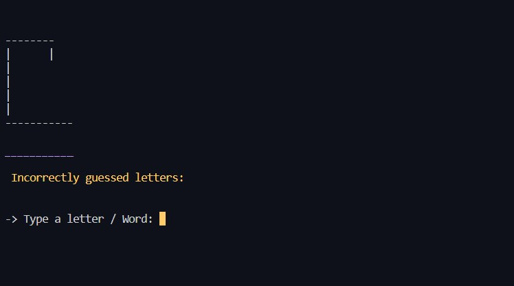
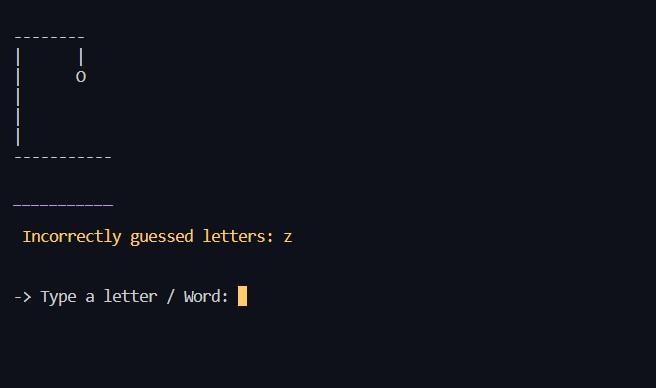
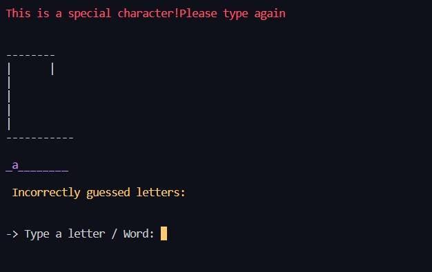
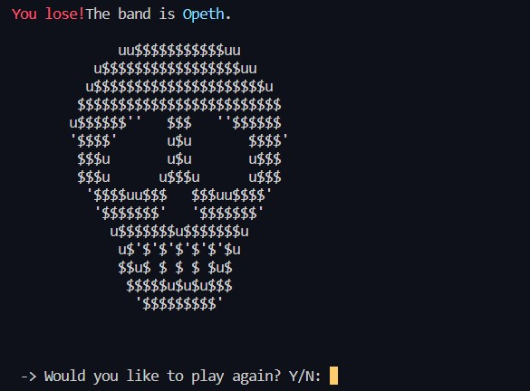
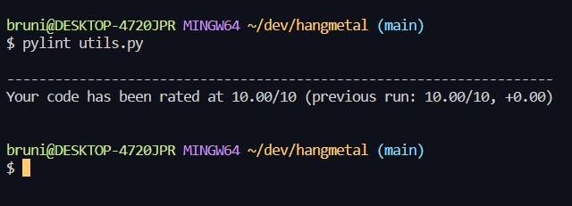

# Hangmetal

Welcome to the captivating world of Hangmetal! Immerse yourself in the realm of thunderous riffs, blazing solos, and intense guttural vocals. Get ready to test your metal knowledge by guessing the names of legendary metal bands, one letter at a time, or if you already know the answer type the word.

With every correct guess, you are close to winning! But be cautious, as each wrong guess brings you nearer to the metalhead's dreaded fate - the hanged man!
Summon your inner metal aficionado, and embark on this journey through Hangmetal. Every attempt can reveal a band that you don't know and increase your knowledge about this beautiful music genre.

The Hangmetal project is live, the links can be found [HERE](https://hangmetal-a0fc16afad72.herokuapp.com/)

## Table of Contents
+ [Features](#features "Features")
  + [Main page](#main-page "Main page")
  + [Game Screen](#game-Screen "Game Screen")
  + [Incorrect Attempt](#incorrect-attempt "Incorrect Attempt")
  + [Type Warning](#type-warning "Type warning")
  + [Correct Attempt](#correct-attempt "Correct Attempt")
  + [Win Screen](#win-screen "Win Screen")
  + [Lose Screen](#lose-screen "Lose Screen")
  + [Exit Game](#exit-game "Exit game")
+ [Flow Chart](#flow-chart "Flow Chart")
+ [Testing](#testing "Testing")
  + [Functional Testing](#functional-testing "Functional Testing")
+ [Validator](#validator "Validator")
  + [Validator ](#validator "Validator")
  + [Unfixed Bugs](#unfixed-bugs "Unfixed Bugs")
+ [Tools and Libraries ](#tools-and-libraries "Tools and Libraries ")
  + [Main Languages Used](#main-languages-used "Main Languages Used")
  + [Programs Used](#programs-used "Programs Used")
+ [Deployment](#deployment "Deployment")
+ [Credits](#credits "Credits")
  + [Content](#content "Content")
  

## FEATURES

### Main page:
This page showcases the game's title in a distinct font style, while also providing users with the opportunity to review the instructions and make an informed decision on whether they wish to start the game.

### Game Screen: 

Within the game interface, you will find a prominent display of the hangman's progress, accompanied by blank spaces representing the letters of the word to be guessed. Additionally, below this, you will observe the incorrect answers or letters attempted. Furthermore, there is a designated area to input the letters or words.

### Incorrect Attempt:
Here we can see what is occurring if the letter guessed is wrong.

### Type warning:
The system is designed to display an warning message atop the screen whenever the user attempts to input a space, number, or special character, informing them that the input is incorrect. The message prompts the user to re-enter the input accurately.

 - For numbers:

 - Space

### Correct Attempt:
Here we can see what is occurring if the letter guessed is write.

### Win Screen:
If the user correctly guesses the answers before using up all their attempts, a "Win" display will appear, along with relevant visuals. They can then choose to play again or return to the starting screen.

### Lose Screen:
If the user guessed all the attempts incorrectly, a "Lose" display will appear, along with relevant visuals and the name of the band. They can then choose to play again or return to the starting screen.

### Exit game:
If the user chooses to discontinue the game by pressing 'n' in response to the prompt, a corresponding message will be displayed.

## Flow Chart
I utilized [LUCIDCHART](https://www.lucidchart.com/). to design a flowchart that assisted me in both conceptualizing the app's logic and implementing its code.

## Testing

Friendly reminder that this game is incompatible with mobile devices, as it operates within a mock terminal environment (credits to Code Institute for creating the mock terminal). Consequently, no testing for accessibility or responsiveness has been conducted due to its nature. Your understanding is greatly appreciated.

## Functional Testing

| INPUT                                  | Action                                                                              | Expected                                                                                                        | Result      |
|----------------------------------------|-------------------------------------------------------------------------------------|-----------------------------------------------------------------------------------------------------------------|-------------|
| Would you like to start the game? Y/N: | -user enters "y" + press Enter                                                      | - start the game                                                                                                | as expected |
|                                        |                                                                                     |                                                                                                                 |             |
|                                        | -user enters "n" + press Enter                                                      | - exit the game; - show a message                                                                               | as expected |
|                                        | -user enters a character, number or spaces + press Enter                            | - show an invalid message; - input a new answer again                                                           | as expected |
|                                        |                                                                                     |                                                                                                                 |             |
| Type a letter / Word:                  | - user enters a valid letter or a word + press Enter; - is a right guess            | - update letter in word displayed                                                                               | as expected |
|                                        | - user enters an invalid character, number or spaces + press Enter                  | - show an invalid message; - input a new answer again                                                           | as expected |
|                                        | - user enters a valid letter or a word + press Enter; -is a wrong guess             | - show in the section labeled "Incorrectly Guessed Letters,"  and reveal a portion of the hangman illustration. | as expected |
|                                        |                                                                                     |                                                                                                                 |             |
|                                        | - user enters a correct guesses(letter/word) + press Enter; - less than 6 attempts. | - show a winning message and the name of the band; - display ASCII art.                                         | as expected |
|                                        | - user enters an incorrect guesses(letter/word) + press Enter; - 6 attempts.        | - show a losing message and the name of the band; - display ASCII art.                                          | as expected |
| Would you like to play again? Y/N:     | -user enters "y" + enter                                                            | - show the initial screen                                                                                       | as expected |
|                                        | -user enters "n" + enter                                                            | - show the initial screen                                                                                       | as expected |
|                                        | -user enters a character, number or spaces + press Enter                            | - show an invalid message; - input a new answer again                                                           |             |

## Validator
- The code has been validated by [PEP8 Online](https://pep8ci.herokuapp.com/).
- [Pylint](https://pypi.org/project/pylint/) installed in VsCode.

  - Run.py

  - Game.py

  - Animations.py

  - Data.py

  - Hangman.py

  - Utils.py

###  Bugs

## Technologies Used
### Main Languages Used
- Python

### Tools and Libraries 
- `Vs Code`: to write, edit code, and execute Git commands via the terminal.
- `GitHub`: to store the repository for submission.
- `Lucid`: to create the mock up the project.
- `Heroku`: to deploy the live version of the terminal
- `Git`:
    The code has been successfully pushed to the remote repository on GitHub using the following sequence of Git commands:

    - git add .: This command adds the files that are ready for committing.
    - git commit -m "message": Here, the code changes are committed to the local repository, making them ready for the next step.
    - git push: Finally, this command is used to push the committed code to the remote repository on GitHub. This completes the process of updating the remote repository with your changes.

## Libraries
- `colorama`: used to apply color to the game running in the terminal, used across the code.
- `os`: used to clear the terminal within clear() function;
- `sys`: used to exit exit the program within play_again_or_exit() function;
- `random`: used to generate random number to be guessed in the game within generate_random_number() function;

## Deployment
  ### Heroku:
- Steps for deploying the project on Heroku - created for the Code Institute python-essentials-template:
To ensure proper functionality within the provided template, include the \n method for capturing inputs prior to deployment.
    - Create a list of dependencies needed for Heroku deployment by using the terminal command pip3 freeze > requirements.txt*. This will add the requirements to the "requirements.txt" file.
     - Access Heroku, sign in to your account or create a new account if required.
    - From the Heroku dashboard, click the dropdown labeled "New" and select "Create new app".
     - In the "App name" field, input the unique app name "hangmetal". Under "Choose a region", select "Europe" and then click "Create app".
     - Navigate to the "Settings" tab in the top menu.
     - Scroll down on the next page to "Config Vars" and click "Reveal Config Vars".
     - In the provided box, replace "KEY" with "CREDS". Access the "creds.json" file, copy its contents, and paste them into the box, replacing "VALUE". Click "Add".(This step it is not mandatory if you don't have nothing on "creds.json").
     - For the second set of boxes, replace "KEY" with "PORT" and "VALUE" with "8888".
     - Scroll further down to the "Buildpacks" section and click "Add buildpack".
        - In the new box, select "python" and click "Add Buildpack". Repeat this action, but this time select "node.js".
        - Confirm that the buildpacks are in the correct order. Python should be listed first at the top. If necessary, adjust their order by dragging and dropping.
     - Proceed to the "Deploy" tab in the top menu. Under "Deployment method", choose "GitHub" and click "Connect to GitHub" to establish the connection.
     - In the "Connect to GitHub" section, search for the repository named "hangmetal". Click "Search", and then select "Connect" to establish the connection.
     - During the first deployment, scroll down to "Manual deploy" and click "Deploy Branch". This allows you to view the build logs as the app is being constructed.
     - After the initial deployment, enable "Enable Automatic Deploys" to ensure the app remains up-to-date following each push.

  ### Local
  For clonning the project you can log in (or sign up) to GitHub.
   - Go to the repository for this project, [Hangmetal](https://github.com/Bruna-Andelieri/hangmetal).
  - Click on the code button, select whether you would like to clone with HTTPS, SSH or GitHub CLI and copy the link shown.
  - Open the terminal in your code editor and change the current working directory to the location you want to use for the cloned directory.
  - Type 'git clone' into the terminal and then paste the link you copied. Press enter.

## Credits

### Content

- [Font Art](https://fsymbols.com/text-art/) used for creat the HANGMETAL.
- [ASCII ART](https://www.asciiworld.com/) used for the art in animations file.
- Inspired by this Youtube channels:
    - [Leonardo Alves](https://www.youtube.com/@LeonardoAlves-wf1tx)
    - [Kite](https://www.youtube.com/@KiteHQ)
